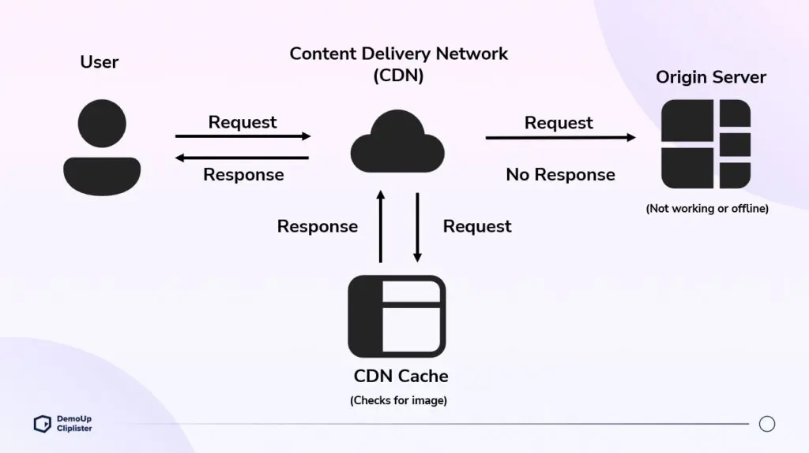

> 웹 사이트를 운영하면서 캐시는 어떤 방식으로 설정할 수 있고 정확히 사용자에게 어떻게 적용되는지 파악하여 더 나은 사용자 경험을 제공하기 위해 캐시에 대해서 알아보겠습니다.

###

# 웹 캐시란
웹 캐시(web cache) 또는 HTTP 캐시(HTTP cache)는 서버 지연을 줄이기 위해 웹 페이지, 이미지, 기타 유형의 웹 멀티미디어 등의 웹 문서들을 임시 저장하기 위한 정보기술입니다. 웹 캐시가 저장소 내에 요청된 리소스를 가지고 있다면, 요청을 가로채 원래의 서버로부터 리소스를 다시 다운로드하는 대신 복사본을 반환합니다. 리소스를 회신하는데 더 적은 시간이 들게 되지만, 모든 리소스가 영원히 변하지 않는 것은 아니므로 리소스가 변하기 전까지만 캐싱하고 이후에는 더이상 캐싱하지 않도록 관리하는 것이 중요합니다.


# 캐싱 동작 대상
- 검색(retrieval) 요청의 성공적인 결과: HTML 문서, 이미지 혹은 파일과 같은 리소스를 포함하는 GET 요청에 대한 200(OK) 응답.
- 영구적인 리다이렉트: 301 (Moved Permanetly) 응답.
- 오류 응답: 404 (Not Found) 결과 페이지.
- 완전하지 않은 결과 206 (Partial Content) 응답.
- 캐시 키로 사용하기에 적절한 무언가가 정의된 경우의 GET 이외의 응답.


# 캐싱 제어
**1. max-age**
  ```
  Cache-Control: max-age=31536000(1년)
  => 리소스가 유요하다고 판단되는 최대 시간을 말합니다. 요청 시간에 상대적이며,   
  Expires가 설정되어 있어도 우선됩니다.
  ```
**2. no-store**
  ```
  Cache-Control: no-store
  => 캐시는 클라이언트 요청 혹은 서버 응답에 관해서 어떤 것도 저장하지 않고   
  서버 측으로 전송되어 전체 응답을 매번 다운로드 합니다.
  ```
**3. no-cache**
  ```
  Cache-Control: no-cache
  => 캐시는 저장하지만 사용하려고 할 때마다 서버에 재검증 요청을 보내야 합니다.
  ```
**4. private, public**
  ```
  Cache-Control: private
  => 공유 캐시에 의해 저장되어서는 안되는, 단일 사용자만을 위한 캐시를 저장할 수 있습니다.
  Cache-Control: public
  => 어떤 캐시든 허용합니다. 보통 캐시 가능하지 않은 응답 상태코드를 지닌 페이지가   
  이제 캐시되어야할 경우 유용할 수 있습니다.
  ```
**5. s-max-age**
  ```
  Cache-Control: s-maxage=31536000, max-age=0
  => CDN과 같은 중간 서버에서만 적용되는 max-age값을 설정합니다.
  ```
**6. 검증**
  ```
  Cache-Control: must-revalidate
  => 리소스가 오래된 것인지 검증을 유발합니다.
  ```


# 캐시 검증
캐시된 문서의 만료 시간이 가까워져오면, 문서가 검증되거나 다시 불러오게 됩니다. 검증은 서버가 강한 검증 혹은 약한 검증 중 하나라도 제공하는 경우에만 일어날 수 있습니다.

### **ETags**
강한 검증으로써 그 값이 무엇을 표현하는지, 예측될 수 없는 값입니다. 본문을 제외한 리소스에 포함된 ETag값이 다르다면 **If-None-Match**헤더를 포함하여 리소스가 변경되었음을 알릴 수 있습니다.

### **Last-Modified**
약한 검증으로써 사용될 수 있습니다. Last-Modified 헤더가 응답 내에 존재하면, 클라이언트는 캐시된 문서를 검증하기 위해 **If-Modified-Since** 헤더를 새 요청에 포함할 수 있습니다.


# 캐시의 위치
</img>
Origin 서버의 원래 응답을 CDN이 캐싱하고, CDN의 응답을 사용자 브라우저가 가져와서 캐시합니다. HTTP 캐시는 여러 레이어에 저장될 수 있어 세심히 다루어야 합니다.   
**CDN Invalidation**은 가운데에 위치하는 CDN에 저장되어 있는 캐시를 삭제한다는 뜻입니다. 하지만 브라우저의 캐시는 다른 곳에 위치하기 때문에 CDN의 캐시를 삭제한다고 해서 브라우저 캐시가 삭제되지 않습니다. 전체 캐시를 삭제하기 위해서는 중간 서버 브라우저와 중간 서버 각각에 대한 캐시를 삭제해야 합니다.
#
> 리소스의 성격에 따라 적절한 캐시 제어를 설정하는 것은 많은 노력과 고민이 필요한 것 같습니다. 그에 따라 사용자는 높은 응답 시간을 경험할 수 있으니 웹 서비스, 그리고 다른 리소스를 통신하는 부분에서 필수적으로 고려해야 할 것 같습니다.
#

## 참고자료

- [웹 캐시- 위키백과](https://ko.wikipedia.org/wiki/%EC%9B%B9_%EC%BA%90%EC%8B%9C)
- [HTTP 캐싱 - MDN Web Docs](https://developer.mozilla.org/ko/docs/Web/HTTP/Caching)
- [웹 서비스 캐시 똑똑하게 다루기 - tosstech](https://toss.tech/article/smart-web-service-cache)
