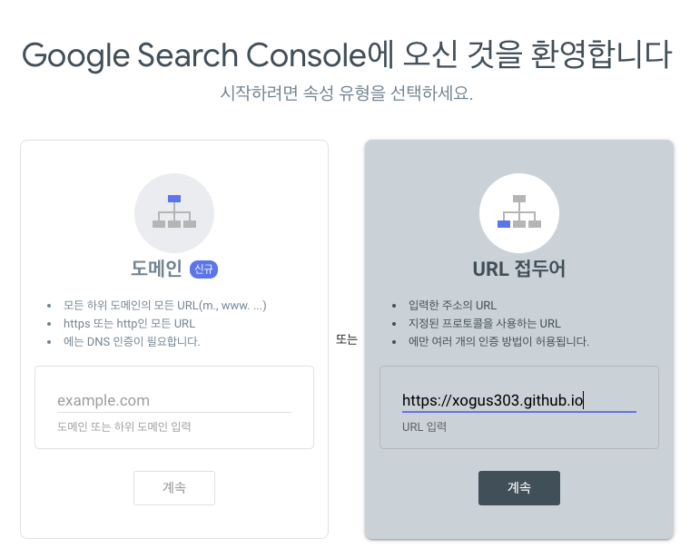
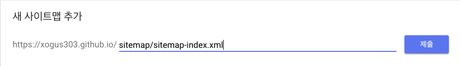
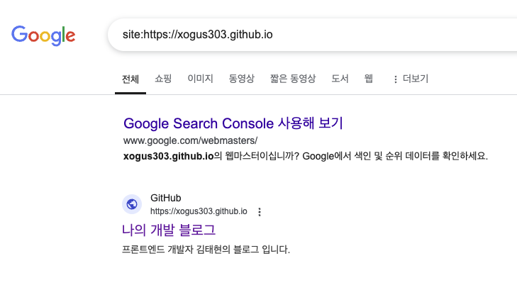

> SEO는 웹사이트가 유기적인 검색 방식을 통해 검색 엔진에서 상위에 노출될 수 있도록 최적화하는 과정을 말합니다. 플랫폼은 검색하는 사람들에게 긍정적인 사용자 경험을 선사하는 것이 목표이기 때문에 가능한 한 최고의 정보를 제공하길 원합니다. 따라서, SEO 노력은 검색 엔진이 특정 검색어에 대한 웹 상의 주요한 정보로 인식하도록 하는 과정에 포커스를 맞추어야 합니다.


---

# SEO란

검색 엔진은 웹을 크롤링하면서 페이지에서 페이지로 링크를 따라가고, 찾은 콘텐츠의 색인을 생성합니다. "색인"이라는 용어는 구글을 예로 들면, 웹 사이트가 구글의 데이터 베이스에 저장되고 검색결과에 표시될 수 있도록 준비된 상태를 의미합니다. 사용자가 검색 결과를 입력했을 때 노출되는 것이 색인된 페이지 입니다. 크롤러는 일정 규칙을 따르므로, SEO를 진행하며 해당 규칙을 밀접하게 따라가면, 웹사이트가 검색 결과의 최상위에 노출될 가능성이 높아집니다. 검색 엔진은 일부 SEO 가이드라인을 제공하긴 하지만, 대형 검색 엔진의 경우 결과 순위는 영업 비밀로 취급합니다. 따라서 SEO는 검색 엔진의 공식 지침에 더해 경험적인 지식, 논문과 특허 등에서 가져온 이론적 지식을 결합한 과정입니다.

# SEO 기본요소
### 설명 URL
최적화의 대상이 되는 검색엔진에서 지원하는 형식에 맞춘 구조로 URL을 구성합니다.
페이지의 URL이 의미 있는 단어들로 구성되어야 합니다.   
`https://www.example.com/pets/cats.html`   
임의의 식별자만 포함된 URL은 사용자에게 도움이 되지 않습니다.
`https://www.example.com/2/6772756D707920636174`   

주제별로 유사한 페이지는 디렉토리 별로 구조화합니다. 크롤러가 페이지 간의 상관간계를 이해하는데 도움을 줍니다.
`https://www.example.com/fruit/apple.html`   
`https://www.example.com/fruit/melon.html`   
`https://www.example.com/fruit/orange.html`


### 관련 리소스 링크
검색엔진은 여러 페이지들에서 주소가 자주 언급된 페이지가 신뢰도 높은 페이지라고 판단합니다. 역으로 높은 신뢰도를 가지는 페이지의 주소를 내 콘텐츠 내에서 많이 언급해도 신뢰도를 높이는 효과를 얻을 수 있습니다. 링크는 콘텐츠와 관련된 내용을 입증하는 다른 리소스에 연결함으로써 가치를 더할 수 있습니다. 다른 콘텐츠 링크를 만들 때 탐색을 위해 다른 HTML DOM 요소에서 자바스크립트 이벤트를 사용하기 보단 `<a>` 요소를 사용합니다.

### 키워드
콘텐츠 내 포함된 특정 키워드의 위치와 갯수 등이 검색 엔진의 평가 알고리즘에서 중요한 부분을 차지합니다. 콘텐츠를 제작할 때 사람들이 검색할만한 키워드를 선정해 제목, 본문 등에 적절하게 삽입해야 합니다. 검색량은 많고, 경쟁은 낮으며, 효과는 높은 키워드를 찾아내는 것이 중요합니다. 검색량이 매우 많은 일반적인 단어를 키워드로 사용하면 많은 사람이 페이지를 클릭해서 보겠지만, 검색자의 구체적인 니즈를 파악하기 힘들기 때문에 실제로 전환이 되는 확률은 낮아지게 됩니다. 따라서 이 글에서도 SEO와 관련된 구체적인 키워드로 `개발자의 SEO`, `SEO 이해`, `Google 상위 검색` 등의 키워드를 사용하였습니다.

### 제목과 스니펫
제목 링크는 검색 결과의 헤드라인 부분으로, 사용자가 클릭할 검색 결과를 결정하는데 도움이 될 수 있습니다. 좋은 제목을 작성하면 Google 검색의 제목 링크에 영향을 줄 수 있습니다. 좋은 제목은 페이지마다 다르며, 명확하고 간결하게 페이지의 콘텐츠를 정확하게 설명해야 합니다. 일반적으로 검색 결과 목록의 제목 링크 아래에는 타겟 페이지에 관한 설명이 포함되어 있어 사용자의 검색 결과 선택에 도움을 주는데 이것을 스니펫이라고 합나다. 스니펫은 메타 설명 태그의 콘텐츠에서 제공될 수 있는데, 좋은 메타 설명은 짧고, 특정 페이지에 고유하며, 페이지의 가장 관련성 높은 요소를 포함합니다.

### 이미지 추가 및 대체 텍스트
선명하고 명확한 이미지를 사용하고 관련된 이미지를 텍스트 근처에 배치하는 것이 좋습니다. 이미지 근처에 표시되는 텍스트는 Google에서 이미지가 무엇에 관한 것인지, 페이지 맥락에서 어떤 의미를 갖는지 이해하는데 도움을 줍니다. 대체 텍스트는 이미지와 콘텐츠 간의 관계를 설명하는 짧은 텍스트 입니다. `img` 요소의 `alt` 속성을 사용하여 추가할 수 있습니다. 검색엔진이 이미지의 내용 및 이미지가 페이지와 어떻게 관련되어 있는지, 관련된 텍스트와도 연관지어 이해하는데 도움을 줄 수 있어 매우 중요합니다.

# Google 검색 작동 방식

### 1. 크롤링
크롤러라는 자동화된 프로그램을 사용하여 인터넷에서 찾은 페이지로부터 텍스트, 이미지, 동영상을 다운로드 합니다.   
모든 웹페이지가 등록되는 중앙 레지스트리가 있는 것이 아니므로 Google은 계속해서 새 페이지와 업데이트된 페이지를 검색하여 파악된 페이지 목록에 추가해야 하는데, 이 프로세스를 **URL 검색** 이라고합니다. Google이 방뭉한 적이 있는 페이지는 파악된 페이지 목록에 추가되어 있으며 다른 페이지는 파악된 페이지에서 **새 페이지로 연결되는 링크를 추출할 떄 발견**되는 경우와 사이트 사유자가 제출한 **사이트맵을 통해 발견**되는 경우가 있습니다.   
페이지의 URL을 발견하면 내용을 확인하기 위해 페이지를 방문(또는 '크롤링')할 수 있습니다. 이때 웹페이지를 가져오는 프로그램을 **Googlebot(또는 크롤러, 로봇, 봇, 스파이더)** 이라고 하는데, 과부하를 피하기 위해 사이트를 너무 빠르게 크롤링하지 않기 위해 사이트의 응답을 사용하도록 프로그래밍 되어 있습니다. 크롤링하는 동안 Google은 브라우저에서 방문 페이지를 렌더링하는 방식과 유사하게 최신 버전의 Chrome을 사용하여 페이지를 렌더링하고 발견된 **자바스크립트를 실행**합니다. Googlebot은 휴대기기 사용자와 데스크톱 사용자 두 가지 유형의 시뮬레이션 크롤러를 검색에서 사용하는데, 대부분의 사이트에서 Google 검색은 주로 모바일 버전 콘텐츠의 색인을 생성합니다. 따라서 대부분의 Googlebot 크롤링 요청에 모바일 크롤러가 사용되며 그 외 소수의 요청에 데스크톱 크롤러가 사용됩니다. 이를 **모바일 중심 색인 생성**이라고 합니다. 크롤링 여부는 Google 크롤러가 사이트에 액세스할 수 있는지에 따라 다르며, 엑세스에 문제가 생기는 경우는 다음과 같습니다.   
- [사이트를 처리하는 서버 관련 문제](https://developers.google.com/search/docs/crawling-indexing/http-network-errors?hl=ko#http-status-codes)
- [네트워크 문제](https://developers.google.com/search/docs/crawling-indexing/http-network-errors?hl=ko#network-and-dns-errors)
- [Googlebot이 페이지에 엑세스하지 못하도록 하는 robots.txt 규칙 문제](https://developers.google.com/search/docs/crawling-indexing/robots/intro?hl=ko)

### 2. 색인 생성
페이지의 텍스트, 이미지, 동영상 파일을 분석하고 대규모 데이터베이스인 Google 색인에 이 정보를 저장합니다.   
이 단계를 색인 생성이라고 하며 `<title>`요소 및 Alt 속성, 이미지, 동영상 등 텍스트 콘텐츠 및 핵심 콘텐츠 태그와 속성을 처리하고 분석하는 작업이 포함됩니다. Google의 색인 생성 프로세스는 검색결과에 표시될 수 있는 **표준 페이지**인지 중복되는 페이지인지를 판단합니다. 표준 페이지를 정하기 위해 인터넷에서 찾은 비슷한 콘텐츠의 페이지를 그룹으로 묶은 다음 이 그룹을 가장 잘 대표하는 페이지를 선택합니다. 이 때 표준 페이지 콘텐츠에 관한 **신호(페이지의 언어, 콘텐츠가 속하는 국가, 페이지의 사용성 등)** 를 수집하며 이는 검색결과에 페이지를 게제하는 다음 단계에서 사용될 수 있습니다.   
색인 생성은 보장되지 않으며 모든 페이지의 색인이 생성되는 것은 아닙니다. 페이지 콘텐츠 및 메타데이터에 따라서도 달라지며 일반적으로 생성에 문제가 생기는 경우는 다음과 같습니다.   
- [페이지 콘텐츠의 품질이 낮음](https://developers.google.com/search/docs/essentials?hl=ko)   
- [Robots `meta` 규칙이 색인 생성을 허용하지 않음](https://developers.google.com/search/docs/crawling-indexing/block-indexing?hl=ko)   
- [웹사이트 디자인으로 인해 색인 생성이 어려울 수 있음](https://developers.google.com/search/docs/crawling-indexing/javascript/javascript-seo-basics?hl=ko)

### 3. 검색결과 게제
사용자가 검색어를 입력하면 Google 컴퓨터는 색인에서 일치하는 페이지를 검색한 다음 **품질이 가장 높고** 사용자의 검색어와 **가장 관련성이 크다**고 판단되는 결과를 반환합니다. 관련성은 사용자의 **위치와 언어, 기기(데스크톱 또는 휴대전화)와 같은 정보**를 비롯하여 수많은 요인으로 결정됩니다. 예를 들어 '자전거 수리점'을 검색하면 파리에 있는 사용자와 홍콩에 있는 사용자에게 서로 다른 결과가 표시됩니다.   
사용자의 검색어에 따라 검색결과 페이지에 표시되는 검색 기능도 달라집니다. 예를 들어 '자전거 수리점'을 검색하면 지역 검색결과가 표시되고 이미지 검색결과는 표시되지 않지만 '최신 자전거'를 검색하면 이미지 검색결과가 표시될 가능성이 더 높습니다.   
Search Console 페이지의 색인이 생성된 것으로 나타나는데 검색결과에 페이지가 표시되지 않는 경우가 있는데, 일반적인 원인은 다음과 같습니다.
- [페이지의 콘텐츠가 사용자의 검색어와 관련이 없음](https://developers.google.com/search/docs/fundamentals/seo-starter-guide?hl=ko#expect-search-terms)
- [콘텐츠의 품질이 낮음](https://developers.google.com/search/docs/essentials?hl=ko)
- [Robots `meta` 규칙으로 게재가 차단됨.](https://developers.google.com/search/docs/crawling-indexing/block-indexing?hl=ko)

# 검색엔진 최적화 작업

저의 게시글 중 [브라우저의 동작 원리](https://xogus303.github.io/web/basicPrincipleOfBrowser) 글에 대하여 "브라우저의 동작 원리" 라는 키워드로 검색 시 검색결과가 상위에 노출되도록 작업을 진행해 보겠습니다.
3월 20일 기준 구글 브라우저에서 검색 했을 때 관련 페이지들이 노출되었고, 페이지를 넘어가면서 검새겅와 연관이 없는 글들이 표시되었고 저의 글은 노출되지 않았습니다.

### 1. 사이트맵 생성
사이트맵은 사이트에 있는 페이지, 동영상 및 기타 파일과 각 관계에 관한 정보를 제공하는 파일입니다. 검색엔진은 이 파일을 읽고 사이트를 더 효율적으로 크롤링합니다.
블로그는 gatsby.js로 만들어져 있기 때문에 [`gatsby-plugin-sitemap`](https://www.gatsbyjs.com/plugins/gatsby-plugin-sitemap/)을 설치하고 gatsby-config.js을 변경합니다. sitemap xml파일은 웹 마스터 도구 중 특정 개수 (대략 5만) 이상의 URL이 담긴 사이트맵을 인식하지 못하는 문제가 발생하기 때문에 `sitemap-0`, `sitemap-1`과 같이 나뉘어 생성되고 `sitemap-index`파일에서 참조합니다.
### 2. Robots.txt 설정
Robots.txt파일은 크롤러가 사이트의 어느 부분에 엑세스할 수 있는지에 관한 규칙이 포함된 간단한 텍스트 파일입니다. 현재 블로그는 모든 페이지가 크롤링 되기를 원하므로 기본적인 형식으로 설정하여 생성합니다.
[`gatsby-plugin-robots-txt`](https://www.gatsbyjs.com/plugins/gatsby-plugin-robots-txt/)를 설치하고 gatsby-config.js파일에 관련 설정을 추가 한 뒤 build 합니다. 빌드 명령어를 통해 컴파일 하게 되면 사이트맵 `sitemap-index.xml`, `sitemap-0.xml`파일과 `robots.txt`가 설정한 build폴더에 생성됩니다.
```javascript
module.exports = {
  ...
  plugins: [
    ...
    'gatsby-plugin-sitemap',
    {
      resolve: 'gatsby-plugin-robots-txt',
      options: {
        policy: [{ userAgent: '*', allow: '/' }],
      }
    }
  ]
}
```
### 3. Search Console
1. [Search Console](https://search.google.com/search-console/welcome?utm_source=about-page) 사이트에 접속 후 URL을 입력하여 속성을 추가합니다.   
2. 소유권 확인
여러 방법이 있으나 **HTML 태그**를 설정하는 방법으로 진행했습니다. [`react-helmet`](https://www.npmjs.com/package/react-helmet)을 사용하여 하나의 페이지에서 모든 컨텐츠가 표시되더라도 한번에 Meta 태그를 설정할 수 있게 하였습니다.   
```   
<meta
  name="google-site-verification"
  content="Meta 태그"
/>   
```   
3. 사이트맵 추가   
위에서 생성된 사이트맵의 경로를 입력하여 사이트맵을 추가합니다.

4. 색인 생성 확인   
`site:블로그 URL`의 형식으로 검색 시 이미지와 같이 검색결과에 표시된다면 색인생성이 완료된 것입니다.



---

> SEO에 대하여 조금 더 깊게 알아보고 구글 검색 엔진에 색인되는 작업까지 해보았습니다. 다음에는 블로그 게시글의 특정 키워드를 입력했을 때 상위 검색결과에 노출되는 최적화 작업까지 하는 것을 목표로 글을 작성해보도록 하겠습니다.

#

## 참고자료

- [<https://ko.wix.com/blog/post/what-is-seo>](https://ko.wix.com/blog/post/what-is-seo)
- [<https://developer.mozilla.org/ko/docs/Glossary/SEO/>](https://developer.mozilla.org/ko/docs/Glossary/SEO/)
- [<https://namooya3.tistory.com/86#google_vignette/>](https://namooya3.tistory.com/86#google_vignette/)
- [<https://developers.google.com/search/docs/fundamentals/seo-starter-guide?hl=ko/>](https://developers.google.com/search/docs/fundamentals/seo-starter-guide?hl=ko/)
- [<https://amaran-th.github.io/React/Gatsby%20%EB%B8%94%EB%A1%9C%EA%B7%B8%20%EA%B2%80%EC%83%89%EC%97%94%EC%A7%84%20%EC%B5%9C%EC%A0%81%ED%99%94(SEO)%ED%95%98%EA%B8%B0/>](https://amaran-th.github.io/React/Gatsby%20%EB%B8%94%EB%A1%9C%EA%B7%B8%20%EA%B2%80%EC%83%89%EC%97%94%EC%A7%84%20%EC%B5%9C%EC%A0%81%ED%99%94(SEO)%ED%95%98%EA%B8%B0/)
