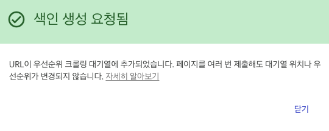

> [개발자의 SEO (1)](https://xogus303.github.io/web/seo)편에서는 SEO 전반적인 이해에 대해서 정리하고 Google Search Console에 등록을 진행해보았습니다. 1편에 이어서 블로그 게시글의 키워드를 Google에 검색했을 때 상위 페이지에 결과가 노출 될 수 있도록 최적화 작업을 해보겠습니다.

---

## 2025.03.27
1편에서 Search Console을 등록하고 검색창에 블로그의 글과 meta 태그로 설정했던 단어들을 검색해 보았습니다. 메인 index 페이지의 `<title>`로 설정해 놓은 "나의 개발 블로그" 키워드만 검색결과의 3번째로 노출될 뿐 나머지는 전부 링크가 노출되지 않았습니다.
   

이 블로그의 첫번째 게시글인 ["브라우저의 동작 원리 - 2.5초 동안 일어나는 일"](https://xogus303.github.io/web/basicPrincipleOfBrowser)의 키워드 검색 시 상위 결과 노출을 목표로 최적화 작업을 하겠습니다.

### URL 검사
Google Search Console의 URL 검사탭에 게시글의 링크를 검사해보니 아래와 같은 결과가 나왔습니다.
이 Google에 등록되어 있지 않음"](../../static/contents/web/seo2/badUrl.png)
 
해당 웹사이트는 사실 Search Console을 이전에 한 번 등록한 적이 있습니다. 그런데 이미지의 맨아래와 같이 "감지된 참조 사이트맵이 없습니다"라고 나오고 "브라우저의 동작 원리" 게시글이 검색되지 않는 것을 보아 사이트맵이 잘못 업로드 된것으로 생각됩니다.
이 Google에 등록되어 있지 않음"](../../static/contents/web/seo2/hasUrl.png)
 
23년에 제출했던 사이트맵이 배포 과정에서 더 이상 확인할 수 없게 되어 발견된 페이지가 없는 정확한 이유는 확인할 수 없게 되었습니다. 사이트맵 파일이 업로드된 폴더 구조가 문제일까 했지만 아래 제출된 참조파일과 실제 사이트맵 목록 파일은 동일한 디렉토리에 업로드 된 것으로 기억하는데, [관련 문서](https://developers.google.com/search/docs/crawling-indexing/sitemaps/large-sitemaps?hl=ko)를 보니 문제가 없다고 결론을 내렸습니다. 우선 확인할 수 없는 기존 사이트맵은 잊어버리고 새로 등록한 사이트맵에서 문제를 파악하겠습니다.

 
위 이미지에서 상태가 "가져올 수 없음"으로 표시가 되고 있는 문제가 있습니다.
그러나 확인해 볼 수 있는 아래 항목들은 모두 문제가 없었고 마지막 크롤링 수요에 대한 부분은 당장 확인이 어려웠습니다.

 
다른 원인을 찾아보다가 URL검사 탭의 화면 우측 "실제 URL 테스트" 버튼이 있어서 실제 게시글 링크를 테스트 해보았습니다.

 
URL 등록 가능 결과를 받았습니다. 페이지에는 문제가 없으나 크롤링 과정에서 어떠한 이유로 색인 처리가 되지 않은것 같습니다.

 
우선 색인 생성 요청을 통해 이 게시글 링크만 요청을 처리하였습니다.

 
이렇게 단일 페이지별로 모두 색인 요청을 하는 것은 비효율적이니 전체적으로 크롤링 과정에서 문제가 없도록 설정이 필요합니다. 하지만 현재 해결 가능한 문제로 보이는 사이트맵은 마땅한 해결방법이 없기 때문에 구글의 크롤링 등 상황을 좀 더 지켜 보고 개선하도록 하겠습니다.

---

> 

#
